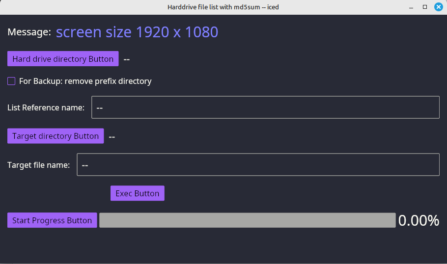

# hdbkmd5sum
Rust-Iced program: reads a hard drive directory and outputs a csv file with vertical bar separator and generates md5sum for each file.
The checkbox is for bluray disks that where dumped to harddrive.
This replaces hdmd5sum and blurays disks that have been dumped to harddrive instead of bkmd5sum that reads bluray disks directly.

This program calls winitsize01 to get the smallest monitor size.

